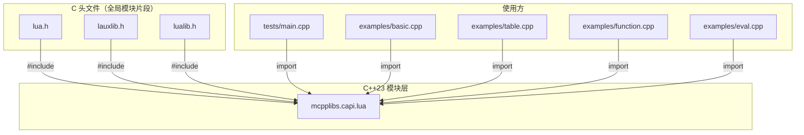
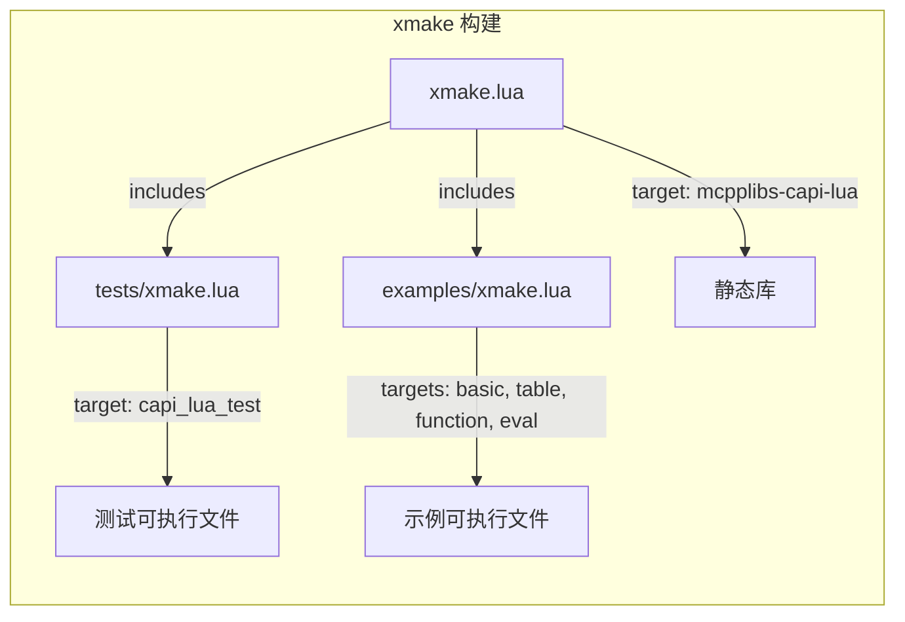

# 架构文档

> mcpplibs/capi-lua 项目架构与设计说明

## 概述

`mcpplibs/capi-lua` 为 Lua C API 提供 C++23 模块化绑定，使其他 mcpplibs 模块可以通过 `import mcpplibs.capi.lua;` 直接使用 Lua，无需手动 `#include` C 头文件。

## 目录结构

```
mcpplibs-capi-lua/
├── src/                        # 模块源码目录
│   └── capi/
│       └── lua.cppm            # 主模块接口文件
├── tests/                      # 测试目录
│   ├── main.cpp                # Google Test 测试入口
│   └── xmake.lua               # 测试构建配置
├── examples/                   # 示例目录
│   ├── basic.cpp               # 基本用法示例
│   ├── table.cpp               # 表操作示例
│   ├── function.cpp            # 函数注册示例
│   ├── eval.cpp                # 脚本求值示例
│   └── xmake.lua               # 示例构建配置
├── docs/                       # 文档目录
│   ├── architecture.md         # 架构文档（本文件）
│   └── pr/
│       ├── design.md           # 设计文档
│       └── tasks.md            # 任务清单
├── .github/workflows/          # CI/CD 配置
│   └── ci.yml                  # GitHub Actions 流水线
├── xmake.lua                   # xmake 构建配置（主配置）
├── CMakeLists.txt              # CMake 构建配置
├── config.xlings               # xlings 工具链配置
├── .gitignore                  # Git 忽略规则
├── .gitattributes              # Git 属性（.cppm 语言识别）
├── LICENSE                     # Apache-2.0 许可证
└── README.md                   # 项目说明
```

## 模块架构

### 封装模式



### 模块文件结构

```cpp
module;                                 // 全局模块片段

#include <lua.h>                        // Lua 核心 API
#include <lauxlib.h>                    // 辅助库
#include <lualib.h>                     // 标准库

export module mcpplibs.capi.lua;        // 模块声明

export namespace mcpplibs::capi::lua {  // 统一命名空间

    // 类型别名（using）
    using State = ::lua_State;

    // 常量（inline constexpr）
    inline constexpr int OK = LUA_OK;

    // 函数（inline 转发）
    inline State* L_newstate() { return ::luaL_newstate(); }
}
```

### 命名映射规则

| C API 前缀 | 模块内规则 | 示例 |
|---|---|---|
| `lua_` | 去前缀 | `lua_gettop` → `gettop` |
| `luaL_` | 去 `luaL_` 改为 `L_` | `luaL_newstate` → `L_newstate` |
| `LUA_` | 去前缀 | `LUA_OK` → `OK` |
| `luaopen_` | 去 `luaopen_` 改为 `open_` | `luaopen_base` → `open_base` |

### 封装分类

| 类别 | 技术手段 | 数量 |
|---|---|---|
| 类型别名 | `using Type = ::lua_Type;` | 15+ |
| 常量 | `inline constexpr int X = LUA_X;` | 50+ |
| C 函数转发 | `inline ... func(...) { return ::lua_func(...); }` | 80+ |
| 宏转函数 | `inline ... func(...) { ... }` | 20+ |
| 变参转发 | `template<typename... Args> inline ...` | 3 |

## 编码规范

遵循 [mcpp-style-ref](https://github.com/mcpp-community/mcpp-style-ref) 编码规范：

| 类别 | 风格 | 示例 |
|------|------|------|
| 类型名 | PascalCase（大驼峰） | `State`, `Number`, `CFunction` |
| 函数 | snake_case（下划线） | `gettop()`, `L_newstate()` |
| 常量 | UPPER_SNAKE | `OK`, `TNIL`, `MULTRET` |
| 命名空间 | 全小写 | `mcpplibs::capi::lua` |

## 构建系统

### 构建流程



### xmake

主构建配置 `xmake.lua` 定义静态库 target，并通过 `includes` 引入子目录的构建配置：

```lua
add_rules("mode.release", "mode.debug")
set_languages("c++23")
add_requires("lua")

target("mcpplibs-capi-lua")
    set_kind("static")
    add_files("src/capi/*.cppm", { public = true, install = true })
    add_packages("lua", { public = true })
    set_policy("build.c++.modules", true)

includes("examples", "tests")
```

关键配置说明：
- `add_requires("lua")` — xmake 自动下载并编译 Lua
- `add_packages("lua", { public = true })` — 公开传递 Lua 头文件和链接库给依赖方
- `set_policy("build.c++.modules", true)` — 启用 C++23 模块支持

## CI/CD 流水线

### 多平台构建矩阵

| 平台 | 编译器 | 构建 | 测试 | 示例 |
|------|--------|------|------|------|
| Linux (Ubuntu) | GCC 15.1 | Y | Y | Y |
| macOS | LLVM 20 | Y | - | - |
| Windows | MSVC | Y | Y | Y |

## 参考

- [Lua 5.4 Reference Manual](https://www.lua.org/manual/5.4/)
- [mcpp-style-ref | 现代C++编码/项目风格参考](https://github.com/mcpp-community/mcpp-style-ref)
- [mcpplibs/templates | 项目模板](https://github.com/mcpplibs/templates)
